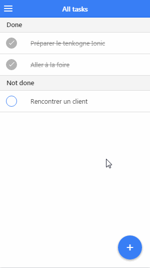

IONIC 101
========
Create mobile apps with the web technologies you love.

This project aims to introduce some basic concepts of Ionic Framework through a Todo mobile application.

### Prerequisites
1. You must have a **gitlab.com** account.
2. You must have installed in your system:
   - `npm` > https://www.npmjs.com/get-npm
   - `git` > https://www.atlassian.com/git/tutorials/install-git
   - `bower` > `npm install -g bower`

## Step 0 : créer et pousser le projet
1. Créer un repository mytodo sur gitlab.com.
2. Executer les commandes suivantes :

```
$ mkdir ionic & cd ionic
$ ionic start --appname MyTodo mytodo --template blank
$ cd mytodo
$ git init
$ echo .editorconfig >> .gitignore
$ git add .
$ git commit -m "init ionic project"
$ git remote add origin git@gitlab.com:[votre_user]/mytodo.git
$ git push -u origin master 
```
`ionic start [options] <PATH> [template]`<br>
Cette commande permet de créer un projet ionic. 

## Step 0 bis: voir le projet 
Dans cette partie, nous allons:
1. installer Ionic CLI
```
$ npm install -g ionic
```
`ionic -v` pour connaitre la version installée.<br>
`ionic --help` vous donne toute l'aide du CLI.

2. créer un projet ionic avec `ionic start` (déjà fait cependant dans notre cas)
3. executer notre projet en local pour voir de quoi ça a l'air
```
$ ionic serve
```
`ionic serve -l` pour voir le rendu de l'application mobile sur différentes plateformes.

## Step 1: créer le projet todo
Nous allons à ce niveau créer notre application mobile de todo list. <br>



### Créer le sidemenu

Ionic fournit des composants qui facilitent la mise en place d'un sidemenu dans une application mobile.
```
<ion-side-menus></ion-side-menus>
<ion-side-menu></ion-side-menu>
<ion-side-menu-content></ion-side-menu-content>
```
Dans `index.html`, remplaçons `ion-pane` par `ion-side-menus`
```
<body ng-app="starter">
  <ion-pane>
    <ion-header-bar class="bar-stable">
      <h1 class="title">Ionic Blank Starter</h1>
    </ion-header-bar>
    <ion-content>
    </ion-content>
  </ion-pane>
</body>
```
devient
```
<body ng-app="starter">

  <ion-side-menus>

      <ion-side-menu side="left">
        <ion-header-bar class="bar-assertive">
          <h1 class="title">My Todo</h1>
        </ion-header-bar>
        <ion-content>
          <div class="list">
            <a class="item item-icon-left" href="#/app/new-task" menu-close>
              <i class="icon ion-android-add-circle"></i>
              Add a new task
            </a>
            <a class="item item-icon-left" href="#/app/tasks" menu-close>
              <i class="icon ion-social-buffer"></i>
              All tasks
            </a>
          </div>
        </ion-content>
      </ion-side-menu>

      <ion-side-menu-content>
        <ion-nav-bar class="bar-positive">
          <ion-nav-back-button>
          </ion-nav-back-button>
          <ion-nav-buttons side="left">
            <button class="button button-icon button-clear ion-navicon" menu-toggle="left">
            </button>
          </ion-nav-buttons>
        </ion-nav-bar>
        <ion-nav-view name="menuContent"></ion-nav-view>
      </ion-side-menu-content>

    </ion-side-menus>
    
</body>
```
`<ion-pane></ion-pane>` est un conteneur. Il reçoit le header (`<ion-header-bar></ion-header-bar>`) et le contenu de l'application (`<ion-content></ion-content>`). <br> 
Il est remplaçé par la directive `<ion-side-menus></ion-side-menus>`.

## Créer les différentes vues de l'app

### Créer la page 'All tasks'

Nous allons créer un controleur `TasksCtrl` dans le fichier `controllers.js` puis à l'intérieur de celui ci nous initialisons un json array de tâches en dur.
```
angular.module('todo', [])

.controller('TasksCtrl', function($scope, $rootScope) {

  $rootScope.tasks = [
    {title: 'Préparer le tenkogne Ionic', done: true},
    {title: 'Aller à la foire', done: true},
    {title: 'Rencontrer un client', done: false}
  ];

});

```

Dans `app.js` le module `todo` comprenant le contrôleur `TasksCtrl` est ajouté comme dépendance du module principal de l'application `starter`
```
angular.module('starter', ['ionic', 'todo'])
```
Ionic utilise AngularUI Router qui permet d'organiser l'application en plusieurs états.<br>
La directive `ionNavView` est utilisé en concordance avec Angular UI Router pour afficher en un endroit (ici `index.html`) la vue correspondant à un état donné. Un état va correspondre à une vue indiquée par une URL `templateUrl`.<br>
Du coup pour mettre en place les différents états de notre application, nous créeons un dossier templates comportant les différentes vues de l'application. Le menu résidera dans `templates/menu.html` et `index.html` devient: 
```
<body ng-app="starter">
  <ion-nav-view></ion-nav-view>
</body>
```
La liste des tâches créées dans le contrôleur `TasksCtrl` sera affichée par la vue `templates/tasks.html`.<br>
`app.js` sera adapté comme ci dessous pour proposer la bonne vue en fonction de l'url invoquée.<br><br>
Dans `app.js` on ajoutera aussi:
```
.config(function($stateProvider, $urlRouterProvider) {
  $stateProvider
    .state('app', {
      url: '/app',
      abstract: true,
      templateUrl: 'templates/menu.html',
      controller: 'TasksCtrl'
    })
    .state('app.tasks', {
      url: '/tasks',
      views: {
        'menuContent': {
          templateUrl: 'templates/tasks.html',
          controller: 'TasksCtrl'
        }
      }
    });

  // if none of the above states are matched, use this as the fallback
  $urlRouterProvider.otherwise('/app/tasks');

})
```
Le fichier `templates/tasks.html`:
```
<ion-view view-title="All tasks">

  <ion-content>

    <div class="item item-divider" ng-if="(tasks|filter:{done:true}).length > 0">
      Done
    </div>
    <ion-list>
      <ion-item ng-repeat="task in tasks | filter : {done : true}" ng-model="task.done" class="checkbox-stable">
        <div class="item-checkbox">
          <label class="checkbox">
            <input type="checkbox" ng-model="task.done" />
          </label>
          <span class="done-task">{{task.title}}</span>
        </div>
      </ion-item>
    </ion-list>

    <div class="item item-divider" ng-if="(tasks|filter:{done:false}).length > 0">
      Not done
    </div>
    <ion-list>
      <ion-item ng-repeat="task in tasks | filter : {done : false}" ng-model="task.done" class="checkbox-positive">
        <div class="item-checkbox">
          <label class="checkbox">
            <input type="checkbox" ng-model="task.done" />
          </label>
          {{task.title}}
        </div>
      </ion-item>
    </ion-list>

  </ion-content>

</ion-view>

```
le fichier `menu.html`:
```
<ion-side-menus>

  <ion-side-menu side="left">
    <ion-header-bar class="bar-assertive">
      <h1 class="title">My Todo</h1>
    </ion-header-bar>
    <ion-content>
      <div class="list">
        <a class="item item-icon-left" href="#/app/new-task" menu-close>
          <i class="icon ion-android-add-circle"></i>
          Add a new task
        </a>
        <a class="item item-icon-left" href="#/app/tasks" menu-close>
          <i class="icon ion-social-buffer"></i>
          All tasks
        </a>
      </div>
    </ion-content>
  </ion-side-menu>

  <ion-side-menu-content>
    <ion-nav-bar class="bar-positive">
      <ion-nav-back-button>
      </ion-nav-back-button>
      <ion-nav-buttons side="left">
        <button class="button button-icon button-clear ion-navicon" menu-toggle="left">
        </button>
      </ion-nav-buttons>
    </ion-nav-bar>
    <ion-nav-view name="menuContent"></ion-nav-view>
  </ion-side-menu-content>

</ion-side-menus>

```
Enfin `css\style.css` est adapté pour affecter un style particulier aux tâches marquées comme 'done':
```
.done-task {
  text-decoration: line-through;
  color: #8f8f8f;
}
```

### Créer la page 'Add a new task'

Pour créer cette page, nous commencerons par créer la vue correspondante dans le dossier `templates`. Il s'agit d'un fichier `new-task.html`.
```
<ion-view view-title="Add a new task">
  <ion-content>
    <form ng-submit="addTask()">
      <div class="list">
        <label class="item item-input item-stacked-label">
          <span class="input-label">Task title</span>
          <input type="text" placeholder="Task" ng-model="task.title">
        </label>
        <label class="item">
          <button class="button button-block button-positive" type="submit">Add</button>
        </label>
      </div>
    </form>
  </ion-content>
</ion-view>

```
Ensuite, nous ferons la redirection vers la vue créée en lui associant un état. Ceci dans `app.js` :
```
.state('app.newTask', {
  url: '/new-task',
  views: {
    'menuContent': {
      templateUrl: 'templates/new-task.html',
      controller: 'TasksCtrl'
    }
  }
})
```
On implémente la fonctionnalité d'ajout de tâche dans notre contrôleur. Nous crééons une fonction `addTask` pour ça:
```
$scope.addTask = function() {
  if (this.task.title) {
    var task = {
      title: this.task.title,
      done: false
    };
    $rootScope.tasks.push(task);
  }
  this.task.title = '';
};
```

## Ajouter la suppression

On décide de proposer la suppression d'une tâche lorsqu'on la glisse vers la gauche comme sur le gif. La directive `ionList` propose l'attribut booléén `can-swipe` indiquant si les éléments de la liste peuvent être 'swipe' pour laisser apparaître des buttons ou pas.<br>
Nous ajoutons l'attribut à nos deux listes dans le fichier `tasks.html`:
```
<ion-list can-swipe="true">
  ...
</ion-list>
```
Puis le button à afficher (`ionOptionButton`) lorsqu'on 'swipe' est ajouté à l'intérieur des directives `ionItem` comme ceci :
```
<ion-list can-swipe="true">
  <ion-item ...>
    ...
    <ion-option-button class="icon button-assertive ion-trash-b" ng-click="deleteTask()" />
  </ion-item>
</ion-list>
```
Un clic sur le bouton devrait supprimer la tâche concernée. On implémente la fonction `deleteTask()` comme ceci:
```
$scope.deleteTask = function () {
  $rootScope.tasks.splice($rootScope.tasks.indexOf(this.task), 1);
}
```

## Ajouter le `floating add button`

Nous voulons ajouter un peu de material design dans notre application. Nous ajoutons au niveau de la liste des tâches un bouton pour l'ajout comme celui ci https://github.com/pregiotek/ion-floating-menu

Pour cela installons le à l'aide de bower.
```
$ bower install ion-floating-menu
```
Cette commande ajoute les fichiers du package dans le dossier `www/lib` de notre projet. Il suffit juste d'adapter notre application en conséquence: <br><br>
Dans `index.html`, on ajoute les fichiers css et js du package :
```
<head>
  ...
  <link href="lib/ion-floating-menu/dist/ion-floating-menu.css" rel="stylesheet" type="text/css"/>
  ...
  <script src="lib/ion-floating-menu/dist/ion-floating-menu.js" type="text/javascript"></script>
  ...
</head>
```
Ensuite, dans `tasks.html` juste après `ionView`, on insère le bouton grâce à ce bout de code :
```
<ion-floating-button click="goToAddTask()" button-class="positive-bg" button-color=""></ion-floating-button>
```
On créé la fonction `goToAddTask()` pour rediriger l'utilisateur vers la page de création de tâche, lorsqu'il clique sur le bouton.<br>
Nous aurons au niveau de notre contrôleur:
```
controller('TasksCtrl', function($scope, $rootScope, $state) {
  ...
  $scope.goToAddTask = function () {
    $state.go('app.newTask');
  }
});
```
Ajoutons enfin `ion-floating-menu` comme dépendance de notre module dans `app.js` :
```
angular.module('starter', ['ionic', 'todo', 'ion-floating-menu'])
```